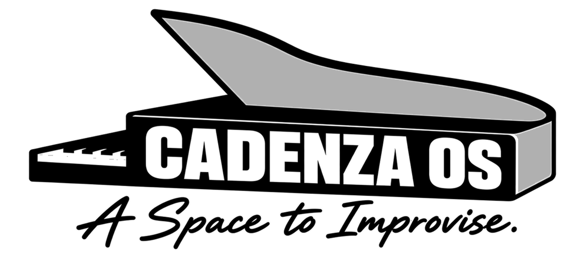

# Cadenza OS

**English** · [简体中文](README.zh-CN.md)

<p align="center">
  
</p>

**Cadenza** is a personal interactive-device and creative platform by Tapir.
Its system, **Cadenza OS**, explores a portable 1-bit App/Runtime, system
interaction model, and animation language for resource-constrained hardware.
The current prototype targets the original LILYGO T-Embed (not the CC1101
edition).

https://github.com/user-attachments/assets/4cbb17ba-b52b-44dc-b557-88dd9fdf3d63

The walkthrough above includes sound and covers Launcher, Timer, the background
Timer indicator, System Menu, Motion, Settings, and Animation Gallery. The
current build also adds the SIGHT note-reading trainer. Cadenza supports the
T-Embed 320×170 and Sharp Memory LCD 400×240 display profiles.

> **Prototype status:** desktop, headless, and firmware build gates are in
> place. Encoder feel, display behavior, real frame rate, and speaker quality
> still require validation on an original T-Embed device.

> **Non-commercial hobby project:** Cadenza is a personal project made for the
> enjoyment of designing and building it. There is no plan to commercialize
> it, sell it, or turn it into a business.

## Motivation

A *cadenza* is a passage in music where a performer is given room for free
expression. That idea fits this project: a restrained and coherent device that
leaves space for small games, tools, animation, and interaction experiments.

Cadenza grows out of Tapir's deep affection for Playdate's design and art
direction—not simply for it as a handheld, but for it as a carefully designed
digital object: a reflective black-and-white display, direct physical input,
expressive motion, and a small set of features with a strong point of view.
Many Launcher behaviors, interaction rhythms, animations, and visual details
in Cadenza deliberately study and attempt to recreate how Playdate works and
feels. Rebuilding those ideas is a way to understand the craft behind them and
to carry that learning into a personal platform, rather than an attempt to run
or replace Playdate software.

The T-Embed is the first software and interaction prototype. The longer-term
hardware direction centers on a 400×240 Sharp `LS027B7DH01` Memory LCD and a
dedicated handheld design. The software is structured so the prototype proves
the platform without defining the final device.

## Highlights

- One 1-bit framebuffer, App/Runtime, and layout model shared by the 320×170
  T-Embed and 400×240 Sharp profiles;
- six built-in Apps—Launcher, Timer, SIGHT, Motion, Settings, and Animation
  Gallery—with encoder navigation, button input, a System Menu, and explicit
  return to Launcher;
- system-owned background Timer, expiry alert, session volume, Reduced Motion,
  and vertical or horizontal Launcher orientation;
- 18 semantic sound cues plus bounded 1–4 note MIDI playback, backed by the
  same 44.1 kHz, four-voice synthesis core in the SDL callback and T-Embed I²S
  task;
- allocation-free Tween, Timeline, Spring, transitions, camera effects,
  particles, and atlas animation state machines;
- an SDL3 desktop simulator, deterministic headless host, PNG/GIF capture,
  pixel snapshots, and tests for lifecycle, input, animation, audio, and system
  services.

Cadenza is currently a 1-bit interaction and animation runtime, not a complete
game engine. Physics, collision, tilemaps, ECS, and level systems are
deliberately out of scope.

## Quick start on macOS

```bash
brew install cmake sdl3
./tools/simulator.py run --profile t-embed --scale 2 --overlay
```

For the source-watching development loop:

```bash
./tools/simulator.py dev --profile t-embed --scale 2 --overlay
```

Common presentation options are `--profile t-embed|sharp`, `--scale 1..4`,
`--palette reflective|pure`, `--overlay`, and `--device-frame`. The default
`reflective` palette approximates a reflective Memory LCD; `pure` is for strict
black-and-white inspection. These options do not change the framebuffer,
captures, snapshot hashes, or firmware output.

## Desktop controls

| Input | Action |
| --- | --- |
| Mouse wheel or `Left` / `Right` | Rotate the encoder |
| Tap `Space` / `Enter` | Click the button |
| Hold `Space` / `Enter` | Open the System Menu |
| `F1` | Toggle the debug HUD |
| `F2` / `F3` | Pause or resume / single-step while paused |
| `F4` / `F5` | Toggle fixed/real step / cycle time scale |
| `F6` / `F7` | Capture PNG / start or stop PNG+GIF recording |

See [`docs/development.md`](docs/development.md) for complete controls, Timer
behavior, display options, and the Launcher Cover workflow.

## Build and verification

```bash
tools/check.sh host           # host build and full test suite
tools/check.sh desktop        # SDL3 build and launch smoke test
tools/check.sh firmware       # ESP-IDF 5.5 T-Embed primary (UAC+CDC)
tools/firmware_uac.sh flash   # flash primary firmware to T-Embed
tools/check.sh firmware-pio   # PlatformIO rollback (no UAC)
tools/check.sh all            # host + desktop + ESP-IDF firmware + diff
```

Primary firmware needs ESP-IDF v5.5 (`CADENZA_IDF_PATH` or `../esp-idf-v5.5`).
PlatformIO rollback (no microphone):

```bash
../.platformio-env/bin/pio run
../.platformio-env/bin/pio run --target upload
../.platformio-env/bin/pio device monitor --baud 115200
```

Create an ad-hoc-signed macOS development package with:

```bash
./tools/simulator.py package
```

The resulting `.app` and zip are intended for local or same-architecture Mac
development. They are not Developer ID signed or notarized releases.

## Hardware safety

The current pin configuration comes from the official original LILYGO T-Embed
configuration. **Do not flash it to a T-Embed CC1101.** Check the packaging and
board markings before using firmware from this repository.

## Development disclosure

Most source code in this repository has been generated and iterated with
**OpenAI Codex** under Tapir's direction. Tapir defines the product vision,
requirements, architecture decisions, review standards, and acceptance
criteria; Codex performs much of the implementation, refactoring,
documentation, and test authoring.

AI-generated code is not treated as independently trustworthy. Accepted
changes are reviewed and checked through builds, tests, snapshots, research
records, and hardware gates where hardware is available. Tapir remains the
project's author and maintainer and is responsible for the work accepted into
the repository.

## Acknowledgements

- Deepest thanks to [Panic](https://panic.com/) and the
  [Playdate](https://play.date/) team. Cadenza would not exist without the
  affection and respect Tapir has for Playdate's industrial design, art
  direction, interaction design, and animation craft. The project openly
  studies and attempts to recreate many of those interaction patterns and
  qualities. Cadenza remains an independent project, is not compatible with
  Playdate software, and is not endorsed by Panic. The vendored Playdate
  Roobert font subset is used under CC BY 4.0 as documented in
  [`THIRD_PARTY_NOTICES.md`](THIRD_PARTY_NOTICES.md).
- [LILYGO](https://www.lilygo.cc/) created the T-Embed hardware used for the
  first prototype and publishes the reference material used by the platform
  adapter.
- SDL3, U8g2, doctest, stb_image_write, and gif-h make the portable build,
  rendering, testing, and desktop tooling possible. Exact versions, source
  boundaries, and licenses are recorded in
  [`THIRD_PARTY_NOTICES.md`](THIRD_PARTY_NOTICES.md).

## Further reading

- [`docs/project-vision.md`](docs/project-vision.md): long-term goals,
  motivation, and hardware direction;
- [`docs/platform-architecture.md`](docs/platform-architecture.md): platform
  responsibilities and architectural boundaries;
- [`docs/development.md`](docs/development.md): development, testing, and
  simulator reference;
- [`docs/verification.md`](docs/verification.md): current evidence, gates, and
  device verification scripts;
- [`docs/engine-adoption-decision.md`](docs/engine-adoption-decision.md): engine
  and library adoption boundaries;
- [`docs/audio-reference-research.md`](docs/audio-reference-research.md): audio
  research and adoption decisions;
- [`docs/audio-asset-contract.md`](docs/audio-asset-contract.md): delivery and
  acceptance rules for future WAV assets.
